# **Sales and Customer Analysis Project**

## **Introduction**
This project aims to analyze sales and customer data to provide insights that can help make better business decisions. By leveraging SQL Server for querying and Tableau for visualization, we explored key trends in sales performance and customer behavior. The analysis is presented through two interactive dashboards: the **Sales Dashboard** and the **Customer Dashboard**.

## **Dataset Description**
The analysis is based on four interrelated datasets:

1. **Products**:
   - `Product ID`: Unique identifier for each product.
   - `Category` and `Sub-Category`: Classification of products.
   - `Product Name`: Description of the product.

2. **Orders**:
   - `Order ID`: Unique identifier for each order.
   - `Order Date` and `Ship Date`: Timeline of the order process.
   - `Customer ID`: Links orders to customers.
   - `Product ID`, `Sales`, `Quantity`, `Discount`, and `Profit`.

3. **Customers**:
   - `Customer ID`: Unique identifier for each customer.
   - `Customer Name`: Name of the customer.

4. **Location**:
   - `Postal Code`, `City`, `State`, `Region`, and `Country/Region`: Geographical details of customers.

## **Objectives**
The primary goals of this project are:

1. To identify key sales trends and customer behavior patterns.
2. To create insights for decision-makers through interactive dashboards.
3. To answer specific business questions related to sales and customers.

## **Technologies Used**
- **SQL Server**: For data querying and exploration.
- **Tableau**: For creating interactive dashboards and visualizations.

## **Dashboards** 
Remember that you can interact with the dashboards at [this link](https://public.tableau.com/app/profile/juan.cruz.aragon/vizzes).

### **Sales Dashboard**
This dashboard provides insights into overall sales performance:

1. **KPIs**:
   - Total Sales
   - Total Profits
   - Total Costs
   - Total Quantity

2. **Visualizations**:
   - **Sales, Costs, and Profits by Subcategory by Year**
   - **Product Performance: Sales vs. Profit by Year**
   - **Monthly Sales Trends by Year**
   - **Monthly Profit Trends by Category by Year**
   - **Orders by Shipping Method by Year**

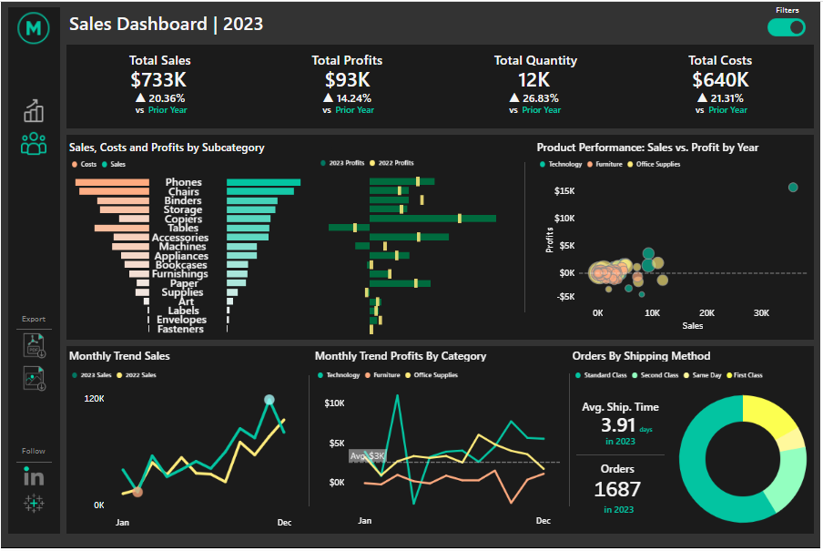

### **Customer Dashboard**
This dashboard focuses on customer insights:

1. **Visualizations**:
   - **Sales by State**
   - **Top 10 States by Sales**
   - **Sales by Customer Segment**
   - **Customer Distribution by Number of Orders**
   - **Top 10 Customers by Profit**

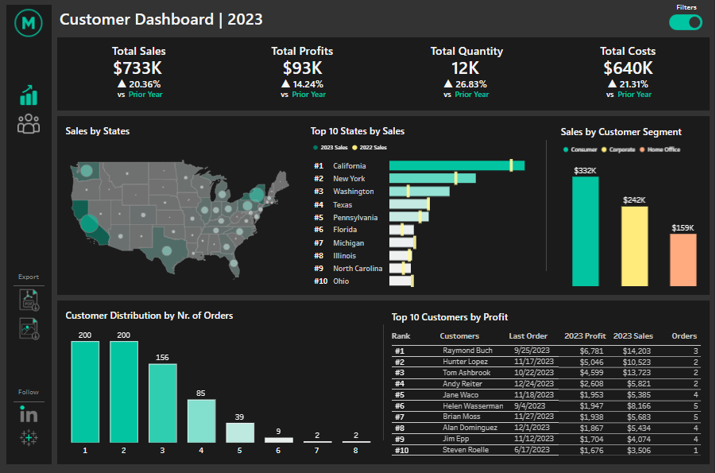

## **Analysis Questions**
- What are the total sales, profits, quantities and costs over the years?
- Which subcategories had the highest and lowest sales, costs, and profits in 2023?
- Which products generate the highest sales but have low profitability, and which products have high profitability despite lower sales?
- How did sales trends evolve month by month in 2023?
- Which categories had the highest and lowest profits each month in 2023?
- Which shipping methods are preferred?
- Which states generate the most revenue?
- Which customer segment generated the highest and lowest sales in 2023?
- How many customers placed multiple orders in 2023, and what was the most common order frequency?
- Who are the most profitable customers?

---
## **Sales and Customer Analysis Insights**

### **1. What are the total sales, profits, quantities and costs over the years?**

#### **Query:**  
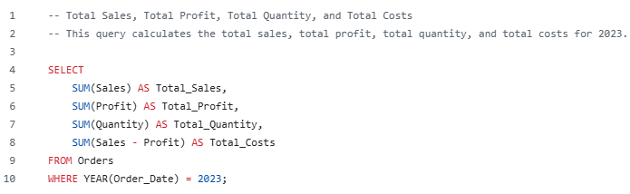

#### **Tableau Visualization:**  
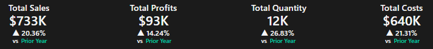

---

### **2. Which subcategories had the highest and lowest sales, costs, and profits in 2023?**

#### **Query:**  
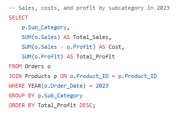

#### **Tableau Visualization:**  
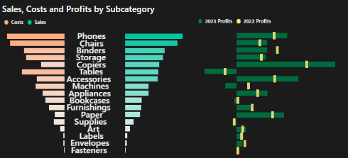

### **Insights**

1. **Most Profitable Subcategory:** Copiers had the highest total profit of **$25,031**, despite having lower total sales (**$62,899**) compared to Phones.
2. **High Sales, Moderate Profit:** Phones generated the highest revenue (**$113,370**) but had a significantly lower profit margin (**$13,860**), suggesting either high costs or aggressive discounting.
3. **Strong Performance in Accessories and Paper:** Both subcategories had good profits, with Accessories at **$17,805** and Paper at **$13,416**, indicating steady demand.
4. **Appliances' Marginal Profitability:** While Appliances had **$43,531** in sales, its profit was only **$8,016**, meaning potential cost issues or pricing inefficiencies.

### **Recommendations**

1. **Optimize Phone Pricing and Costs:** Since Phones generate high revenue but lower profit, analyze cost structures or reconsider discounts to improve margins.
2. **Continue Investing in Copiers & Accessories:** These categories show strong profitability and demand, making them ideal for further promotion and inventory management.
3. **Review Appliance Costs & Discounts:** Appliances’ low profitability suggests evaluating supplier costs, reducing unnecessary discounts, or reconsidering the product mix.
4. **Leverage Paper’s Stability:** Paper has a solid profit margin, making it a steady revenue contributor. Consider bundling strategies to increase volume sales.

---

### **3. Which products generate the highest sales but have low profitability, and which products have high profitability despite lower sales?**

#### **Query:**  
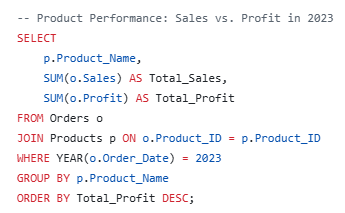

#### **Tableau Visualization:**  
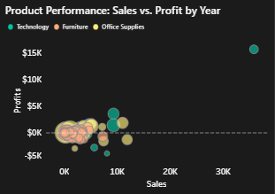

### **Insights**

1. **Best Performing Product:** The **Canon imageCLASS 2200 Advanced Copier** generated the highest profit (**$15,679**) and had the highest total sales (**$35,699**), confirming its strong market demand and profitability.
2. **Other High-Profit Products:** The **Hewlett Packard LaserJet 3310 Copier** and the **GBC DocuBind TL300 Electric Binding System** were also profitable, but at a lower scale, with profits of **$3,623** and **$1,910**, respectively.
3. **Binding Machines Show Consistent Performance:** Both the **Fellowes PB300 Plastic Comb Binding Machine** and the **GBC DocuBind TL300** showed decent profitability, indicating a stable demand in office supplies.
4. **Canon's Strong Presence:** Two **Canon copier models** made it to the top five in terms of profitability, suggesting the brand's strong reputation and customer trust in this segment.

### **Recommendations**

1. **Invest More in Canon Copiers:** The **Canon imageCLASS 2200** is highly profitable, making it a strong candidate for increased inventory and targeted marketing campaigns.
2. **Expand Sales of Binding Machines:** Since both binding machines performed well, exploring bundle deals or volume discounts could further boost sales.
3. **Analyze Lower-Performing Products:** Products with high sales but low profitability should be evaluated to understand cost inefficiencies or pricing strategy issues.
4. **Leverage Brand Loyalty for Future Sales:** The success of **Canon products** suggests an opportunity to introduce and promote newer models under this brand.

---

### **4. How did sales trends evolve month by month in 2023?**

#### **Query:**  
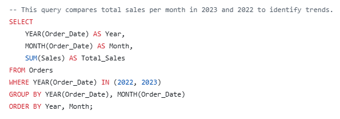

#### **Tableau Visualization:**  
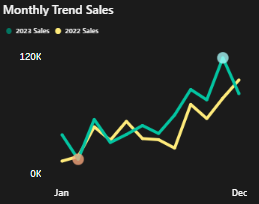

### **Insights**

1. **Overall Sales Growth:** Total sales in 2023 increased by **20.36%** compared to 2022 (**$733,215 vs. $609,205**), indicating a strong upward trend.
2. **Peak Sales Shifted Earlier:** The highest sales month in 2022 was **December** (**$96,999**), while in 2023, the peak was in **November** (**$118,447.83**). This could suggest an earlier holiday shopping season or better **Black Friday promotions**.
3. **Slowest Month Improvement:** The lowest sales month in 2022 was **January** (**$18,542**), while in 2023, it was **February** (**$20,301.13**). Despite February being the weakest month, it still showed a small improvement over the previous year.
4. **Holiday Sales Strengthened:** The **November peak in 2023** outperformed **December 2022**, suggesting that holiday shopping habits may have shifted earlier.

### **Recommendations**

1. **Capitalize on Early Holiday Demand:** Since **November had the highest sales in 2023**, businesses should start holiday promotions earlier and optimize **Black Friday/Cyber Monday** campaigns.
2. **Address Post-Holiday Slumps:** **January and February** continue to be the slowest months. Implement **off-season discounts** or targeted marketing efforts to boost Q1 sales.
3. **Monitor Trends for Further Shifts:** If this earlier peak continues, adjust **inventory planning** and **marketing budgets** accordingly to maximize revenue.
4. **Investigate the Factors Behind the Growth:** The **20.36% overall increase** is positive, but understanding whether it was due to **higher pricing, increased demand, or better promotions** will help refine future strategies.

## **Sales and Customer Analysis Insights**

### **5. Which categories had the highest and lowest profits each month in 2023?**

#### **Query:**  
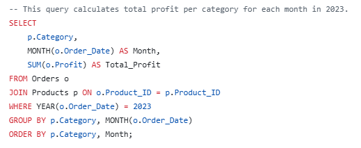

#### **Tableau Visualization:**  
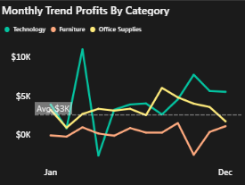

### **Insights**

1. **Best Performing Month per Category:**
   - **Furniture:** September (**$1,632**)
   - **Office Supplies:** August (**$6,227**)
   - **Technology:** March (**$11,084**)

2. **Worst Performing Month per Category:**
   - **Furniture:** October (**-$2,525**, indicating a loss)
   - **Office Supplies:** February (**$667**, lowest but still positive)
   - **Technology:** April (**-$2,647**, indicating a loss)

3. **Overall Category Performance in 2023:**
   - **Technology** had the highest total profit (**$53,557**) across the year.
   - **Office Supplies** generated **$40,805** in profit, showing stability.
   - **Furniture** had the weakest performance with a total profit of **$3,347**, significantly lower than other categories.

### **Recommendations**

1. **Investigate Losses in Furniture & Technology:** The negative profits in October (Furniture) and April (Technology) suggest possible high discounting, inventory costs, or supply chain issues.
2. **Strengthen Sales in Low Months:** February had the lowest profit for Office Supplies, meaning promotions or bundled deals in Q1 could help boost early-year performance.
3. **Capitalize on Strong Months:** Since March (Technology), August (Office Supplies), and September (Furniture) had peak profits, these periods should be prioritized for inventory management and marketing campaigns.
4. **Reevaluate Furniture’s Business Strategy:** Given that Furniture had a total profit of just **$3,347.90**, compared to over **$53K** in Technology, it may be necessary to adjust pricing, reduce costs, or focus on higher-margin items.

---

### **6. Which shipping methods are preferred?**

#### **Query:**  
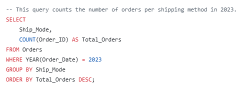

#### **Tableau Visualization:**  
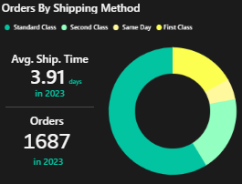

### **Insights**

1. **Most Used Shipping Method:** Standard Class was the most frequently used option, accounting for **990 orders**, making it the dominant shipping method.
2. **Second Class as a Secondary Option:** Second Class shipping was the second most popular with **324 orders**, which is significantly lower than Standard Class.
3. **Expedited Shipping Usage:** First Class was used **284 times**, showing a preference for slightly faster delivery when necessary.
4. **Least Used Method – Same Day Shipping:** Only **89 orders** were shipped using Same Day service, indicating either high costs or low demand for immediate deliveries.

### **Recommendations**

1. **Optimize Standard Class Logistics:** Since Standard Class is the most chosen option, ensuring cost-effectiveness and delivery reliability will improve customer satisfaction.
2. **Encourage Faster Shipping Options:** If Same Day shipping has low adoption, consider promotional discounts or bundling faster shipping with premium services.
3. **Evaluate Customer Demand for Faster Shipping:** If First Class and Same Day are growing in popularity, investing in better inventory placement or distribution centers could improve efficiency.

---

### **7. Which states generate the most revenue?**

#### **Query:**  
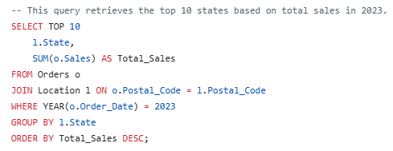

#### **Tableau Visualization:**  
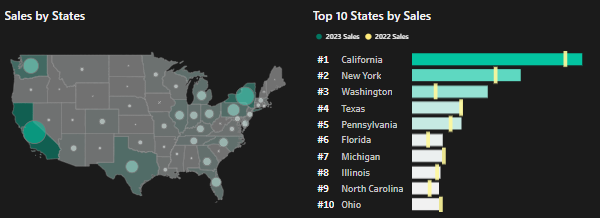

### **Insights**

1. **California Leads by a Large Margin:** California generated **$147,361** in total sales, making it the top-performing state by a wide margin.
2. **New York as the Second Best Performer:** With **$93,922** in sales, New York is significantly behind California but still a strong market.
3. **Washington in a Solid Third Position:** **$65,539** in sales suggests Washington has strong demand but lags behind the top two states.
4. **Texas and Pennsylvania are Competitive:** Texas (**$43,421**) and Pennsylvania (**$42,688**) have close sales figures, indicating they are strong mid-tier performers.

### **Recommendations**

1. **Expand Marketing and Inventory in California & New York:** Given their high sales volumes, increasing targeted promotions and localized inventory in these states can maximize revenue.
2. **Leverage Growth in Washington:** With **$65,539** in sales, Washington is a growing market that may benefit from increased marketing efforts.
3. **Analyze Texas and Pennsylvania Further:** Since their sales figures are similar, exploring local demand patterns could help determine whether pricing, product availability, or competition is affecting growth.
4. **Evaluate Regional Sales Trends for Other States:** If other states are growing faster than expected, consider shifting resources toward emerging markets.

---

### **8. Which customer segment generated the highest and lowest sales in 2023?**

#### **Query:**  
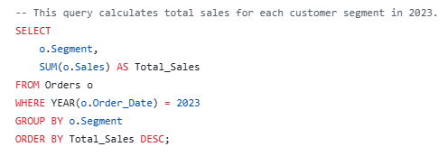

#### **Tableau Visualization:**  
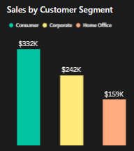

### **Insights**

1. **Consumers Drive the Highest Sales:** The Consumer segment generated **$331,904**, making it the largest revenue contributor.
2. **Corporate Segment Holds a Strong Position:** Corporate customers accounted for **$241,847** in sales, indicating significant B2B demand.
3. **Home Office Segment is the Smallest:** With **$159,462** in sales, Home Office customers contribute the least but still represent a considerable market share.

### **Recommendations**

1. **Enhance Marketing for Consumers:** Since they generate the most revenue, targeted discount campaigns, personalized promotions, and loyalty programs can further increase sales.
2. **Leverage Corporate Accounts for Higher-Value Deals:** The Corporate segment is strong, so focusing on bulk orders, long-term contracts, or business partnerships could improve sales efficiency.
3. **Expand Home Office Offerings:** Despite being the smallest segment, Home Office users may benefit from bundled deals, financing options, or subscription-based purchases to drive growth.
4. **Analyze Profitability by Segment:** Sales alone don’t determine profitability. Checking margins per segment could reveal whether higher sales translate into higher profit.

---

### **9. How many customers placed multiple orders in 2023, and what was the most common order frequency?**

#### **Query:**  

#### **Tableau Visualization:**  
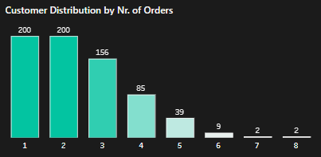

### **Insights**

1. **Most Customers Placed 1-2 Orders:** The highest concentration of customers placed either **1 or 2 orders**, with **200 customers ordering once** and also **200 ordering twice**.
2. **Steady Distribution in 3-5 Orders Range:** Around **250+ customers** placed between **3 and 5 orders**, indicating a solid mid-tier group of repeat buyers.
3. **Potential for Retargeting:** Since the majority of customers placed **5 or fewer orders**, there’s an opportunity to increase retention and order frequency through targeted campaigns.

### **Recommendations**

1. **Encourage Single-Order Customers to Return:** Offer personalized promotions or post-purchase follow-ups to those who only ordered once.
2. **Leverage the 3-5 Order Group for Loyalty Programs:** Customers in this range have shown consistent engagement—introducing loyalty points or incentives could push them toward higher frequency.
3. **Analyze High-Frequency Buyers Separately:** Identifying customers who regularly place **6+ orders** can reveal VIP customers or business accounts that deserve special offers or exclusive discounts.
4. **Optimize Retention Strategies:** If a large number of customers only order once or twice, evaluating the customer journey, pricing, and product selection could improve conversion rates.

---

### **10. Who are the most profitable customers?**

#### **Query:**  
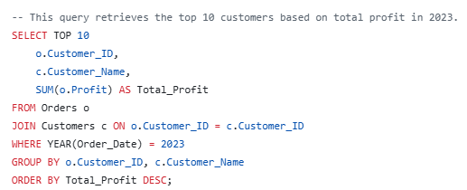

#### **Tableau Visualization:**  
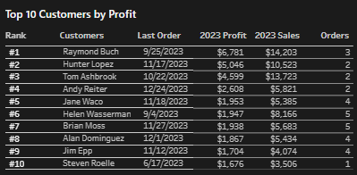

### **Insights**

1. **Most Profitable Customer:** Raymond Buch generated the highest profit of **$6,780**, making him the most valuable customer.
2. **Significant Contribution from Hunter Lopez & Tom Ashbrook:** Both Hunter Lopez (**$5,045**) and Tom Ashbrook (**$4,599**) contributed high profits, indicating strong purchasing behavior.
3. **Profits Drop After the Top 3 Customers:** The profit contribution significantly declines after the top 3 customers, with Andy Reiter (**$2,607**) and Jane Waco (**$1,953**) bringing in much lower figures.
4. **VIP Customers Drive Profitability:** The top 5 customers alone account for a large share of total profit, emphasizing the importance of retaining high-value buyers.

### **Recommendations**

1. **Personalized Retention for Top Customers:** Offering exclusive deals, early product access, or dedicated account managers for high-value customers can increase loyalty and spending.
2. **Analyze Buying Patterns of High-Profit Customers:** Understanding what products or services drive their purchases can help tailor marketing and inventory strategies.
3. **Identify More Potential VIPs:** Customers with strong purchasing potential but lower profit margins might benefit from targeted promotions to encourage higher spending.
4. **Leverage Testimonials & Case Studies:** High-value customers like Raymond Buch and Hunter Lopez could be approached for testimonials or referrals, helping build trust with similar potential buyers.
   
---

## **Project Resources**
- **[Visuals](./visuals)** - Folder containing screenshots of Tableau dashboards.
- **[SQL Queries](./sql_queries)** - Folder containing the SQL queries used in this project.

## **How to Reproduce the Project**
1. Load the datasets into **SQL Server**.
2. Execute the SQL queries provided in the `sql_queries` folder.
3. Interact with the dashboards at [this link](https://public.tableau.com/app/profile/juan.cruz.aragon/vizzes).

---
This project provides a detailed view of sales and customer data, delivering actionable insights for strategic decision-making.

