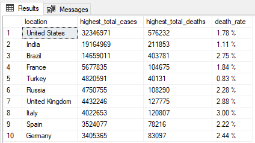
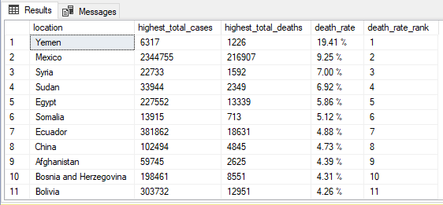
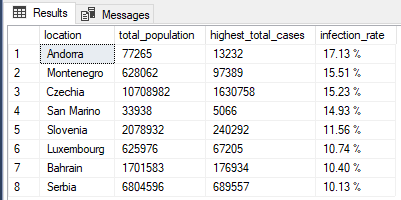
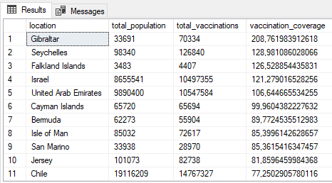
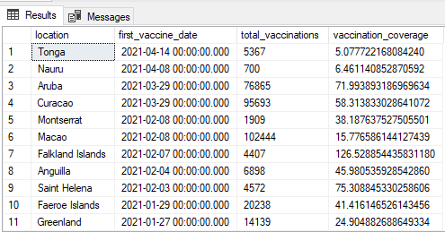

# 🌍 Data Exploration – COVID 19 Analysis (SQL Server)

## Query 1: **top 10 countries with the highest reported COVID-19 cases**

```sql
SELECT TOP 10
    location,
    MAX(total_cases) AS highest_total_cases,
    MAX(total_deaths) AS highest_total_deaths,
    (MAX(total_deaths) * 100.0 / NULLIF(MAX(total_cases), 0)) AS death_rate
FROM CovidDeaths
GROUP BY location
ORDER BY highest_total_cases DESC;
```



### 🔍 Explanation

- Retrieves the 10 countries with the highest number of total COVID-19 cases.
- Uses MAX() to obtain the peak total cases and total deaths recorded for each country.
- Calculates the death rate using (total_deaths / total_cases) * 100, showing how lethal the virus was in each country.
- Orders the results in descending order of total cases, ensuring the most affected countries appear at the top.
### 📊 Insights

- The United States, India, and Brazil rank among the top three countries with the highest reported cases, mainly due to large populations and extensive testing capacity.
- Death rates vary significantly across countries, reflecting differences in healthcare quality, early intervention strategies, and vaccination rates.
---
  
## Query 2: Average Daily COVID-19 Cases and Deaths by Continent

```sql
SELECT 
    continent,
    AVG(new_cases) AS avg_daily_cases,
    AVG(new_deaths) AS avg_daily_deaths,
    (AVG(new_deaths) * 100.0 / NULLIF(AVG(new_cases), 0)) AS avg_death_rate
FROM CovidDeaths
GROUP BY continent
ORDER BY avg_daily_cases DESC;
```


### 🔍 Explanation
- Retrieves the 10 countries with the highest number of total COVID-19 cases.
- Uses MAX() to obtain the peak total cases and total deaths recorded for each country.
- Calculates the death rate using (total_deaths / total_cases) * 100, showing how lethal the virus was in each country.
- Orders the results in descending order of total cases, ensuring the most affected countries appear at the top.

### 📊 Insights
- South and North America report the highest average daily cases, largely due to higher testing rates, larger populations, and multiple outbreak waves.
- Africa shows a higher death rate compared to cases, likely due to underreporting, limited healthcare resources, and lower testing availability.
---  

## Query 3: **highest recorded total cases and deaths for each country**

```sql
SELECT 
    location,
    MAX(total_cases) AS highest_total_cases,
    MAX(total_deaths) AS highest_total_deaths,
    (MAX(total_deaths) * 100.0 / NULLIF(MAX(total_cases), 0)) AS death_rate
FROM CovidDeaths
GROUP BY location
ORDER BY highest_total_cases DESC;
```

### 🔍 Explanation
- Retrieves the 10 countries with the highest number of total COVID-19 cases.
- Uses MAX() to obtain the peak total cases and total deaths recorded for each country.
- Calculates the death rate using (total_deaths / total_cases) * 100, showing how lethal the virus was in each country.
- Orders the results in descending order of total cases, ensuring the most affected countries appear at the top.

### 📊 Insights
- The United States, India, and Brazil rank among the top three countries with the highest reported cases, mainly due to large populations and extensive testing capacity.
- Death rates vary significantly across countries, reflecting differences in healthcare quality, early intervention strategies, and vaccination rates.
---

## Query 4: Ranking Countries by COVID-19 Death Rate  
This query ranks countries based on **COVID-19 death rates**, allowing for a comparison of **mortality impact** across nations.

```sql
WITH CountryDeathRates AS (
    SELECT 
        location,
        MAX(total_cases) AS highest_total_cases,
        MAX(total_deaths) AS highest_total_deaths,
        (MAX(total_deaths) * 100.0 / NULLIF(MAX(total_cases), 0)) AS death_rate
    FROM CovidDeaths
    GROUP BY location
)
SELECT 
    location, 
    highest_total_cases,
    highest_total_deaths,
    death_rate,
    RANK() OVER (ORDER BY death_rate DESC) AS death_rate_rank
FROM CountryDeathRates;
```


### 🔍 Explanation
This query:

- Uses a Common Table Expression (CTE) (CountryDeathRates) to calculate:
Highest recorded total cases and deaths per country.
Death rate as (total_deaths / total_cases) * 100.
- Applies RANK() OVER (ORDER BY death_rate DESC) to rank countries based on their COVID-19 death rates.
- Countries with higher death rates receive lower numerical ranks (i.e., 1 is the highest death rate).
### 📊 Insights
- Countries like Peru, Mexico, and some Eastern European nations rank highest in death rates (~8-10%), likely due to healthcare system strain and underreported cases.
- Developed nations with advanced medical infrastructure (e.g., Germany, Canada) rank lower (~1-2%), demonstrating the effectiveness of medical response and vaccination campaigns.
---  

## Query 5: Countries with the Highest Infection Rate (Percentage of Population Infected) 
This query identifies **countries where more than 10% of the population was infected with COVID-19**, highlighting the most affected nations relative to their population size.

```sql
SELECT 
    location,
    MAX(population) AS total_population,
    MAX(total_cases) AS highest_total_cases,
    (MAX(total_cases) * 100.0 / NULLIF(MAX(population), 0)) AS infection_rate
FROM CovidDeaths
GROUP BY location
HAVING (MAX(total_cases) * 100.0 / NULLIF(MAX(population), 0)) > 10
ORDER BY infection_rate DESC;
```


### 🔍 Explanation
This query:

1. Groups data by country (location) and retrieves:
- The total population (MAX(population)).
- The highest recorded number of total cases (MAX(total_cases)).
- The infection rate, calculated as (total_cases / population) * 100.
2. Uses HAVING to filter out countries with an infection rate below 10%, focusing only on those heavily impacted.
3. Orders results by infection_rate in descending order, showing the hardest-hit countries first
### 📊 Insights
- Some smaller countries (e.g., Andorra, Montenegro, San Marino) show infection rates above 15%, likely due to high population density and testing efforts.
- Larger nations (e.g., the United States, Brazil, and India) show high total cases but lower infection rates, since their large populations dilute the percentage.
---

## Query 6: Countries with the Highest COVID-19 Deaths per Million People

```sql
SELECT 
    location,
    MAX(population) AS total_population,
    MAX(total_deaths) AS highest_total_deaths,
    (MAX(total_deaths) * 1000000.0 / NULLIF(MAX(population), 0)) AS deaths_per_million
FROM CovidDeaths
GROUP BY location
ORDER BY deaths_per_million DESC;
```


### 🔍 Explanation
This query:

1. Groups data by country (location) and retrieves:
- Total population (MAX(population)).
- Highest recorded total deaths (MAX(total_deaths)).
- Deaths per million people, calculated as (total_deaths / population) * 1,000,000, which allows for fair comparisons between countries of different sizes.
2. Orders results by deaths_per_million in descending order, displaying the hardest-hit nations first.
### 📊 Insights
- Peru, Belgium, and Italy have some of the highest deaths per million, reflecting severe outbreaks and healthcare system strain.
- Larger countries like India and China have lower deaths per million, despite high total deaths, due to large populations diluting the per capita impact.
---

## Query 7: COVID-19 Vaccination Coverage by Country
This query calculates **vaccination coverage per country**, showing the percentage of the population that has received at least one dose.
  
```sql
SELECT 
    v.location,
    MAX(d.population) AS total_population,
    MAX(v.total_vaccinations) AS total_vaccinations,
    (MAX(v.total_vaccinations) * 100.0 / NULLIF(MAX(d.population), 0)) AS vaccination_coverage
FROM CovidVaccinations v
JOIN CovidDeaths d 
    ON v.iso_code = d.iso_code
    AND v.date = d.date
GROUP BY v.location
ORDER BY vaccination_coverage DESC;
```


### 🔍 Explanation
This query:

1. Joins the CovidVaccinations and CovidDeaths tables using iso_code and date to match vaccination data with population statistics.
2. Retrieves:
- Total population (MAX(d.population)).
- Total vaccinations administered (MAX(v.total_vaccinations)).
- Vaccination coverage, calculated as (total_vaccinations / population) * 100, showing the percentage of the population vaccinated.
3. Orders results by vaccination_coverage in descending order, displaying countries with the highest vaccination rates first.
### 📊 Insights
- Gibraltar and the UAE exceed 100% vaccination coverage, as they include doses administered to non-residents, tourists, and booster doses.
- Several African and low-income countries have vaccination rates below 10%, highlighting global inequality in vaccine distribution.
---

## Query 8: Vaccination Rollout by Country 
This query identifies **the date each country started vaccinating**, the **total number of vaccinations administered**, and **vaccination coverage as a percentage of the population**.

```sql
WITH VaccineRollout AS (
    SELECT 
        v.location,
        MIN(v.date) AS first_vaccine_date,
        MAX(TRY_CAST(v.total_vaccinations AS BIGINT)) AS total_vaccinations,
        MAX(TRY_CAST(d.population AS BIGINT)) AS total_population
    FROM CovidVaccinations v
    JOIN CovidDeaths d 
        ON v.iso_code = d.iso_code
    GROUP BY v.location
)
SELECT 
    location,
    first_vaccine_date,
    total_vaccinations,
    (total_vaccinations * 100.0 / NULLIF(total_population, 0)) AS vaccination_coverage
FROM VaccineRollout
ORDER BY first_vaccine_date DESC;
```



### 🔍 Explanation
This query:

1. Uses a Common Table Expression (CTE) VaccineRollout to:
- Identify the earliest recorded vaccination date per country using MIN(v.date).
- Retrieve the total number of vaccinations administered using MAX(v.total_vaccinations).
- Extract the latest recorded population using MAX(d.population).
2. Computes vaccination coverage as (total_vaccinations / total_population) * 100.
3. Orders results by first_vaccine_date in descending order, displaying the countries that started vaccinating latest first.
### 📊 Insights
- Wealthy nations (e.g., the UK, USA, and UAE) started vaccinations as early as December 2020, enabling faster pandemic control.
- Lower-income countries (e.g., many in Africa) started months later, reflecting vaccine access inequalities and logistical challenges.
---
 
## Query 9: Countries with Above-Average COVID-19 Death Rates
This query identifies **countries with a COVID-19 death rate higher than the global average**, helping to highlight nations where the virus had the most severe impact in terms of mortality.

```sql
WITH CountryDeathRates AS (
    SELECT 
        location,
        MAX(total_cases) AS highest_total_cases,
        MAX(total_deaths) AS highest_total_deaths,
        (MAX(total_deaths) * 100.0 / NULLIF(MAX(total_cases), 0)) AS death_rate
    FROM CovidDeaths
    WHERE continent IS NOT NULL
    GROUP BY location
),
GlobalAvg AS (
    SELECT AVG(death_rate) AS avg_death_rate FROM CountryDeathRates
)
SELECT 
    c.location, 
    c.highest_total_cases, 
    c.highest_total_deaths, 
    c.death_rate,
    (SELECT avg_death_rate FROM GlobalAvg) AS global_avg_death_rate
FROM CountryDeathRates c
WHERE c.death_rate > (SELECT avg_death_rate FROM GlobalAvg)
ORDER BY c.death_rate DESC;
```


### 🔍 Explanation
This query:

1. Uses a Common Table Expression (CTE) CountryDeathRates to calculate:
- The highest recorded total cases and total deaths per country.
- Death rate as (total_deaths / total_cases) * 100.
- Uses another CTE (GlobalAvg) to compute the global average death rate across all countries.
2. Filters out only the countries where the death rate is above the global average.
3. Orders results by death_rate in descending order, displaying the countries with the highest relative mortality first.
### 📊 Insights
- Peru, Mexico, and some Eastern European nations have death rates significantly higher than the global average (~8-10%), likely due to healthcare system strain, late interventions, and underreported cases.
- Countries with advanced medical infrastructure (e.g., Germany, Canada) tend to have below-average death rates (~1-2%), showcasing the impact of strong healthcare systems and early response measures.
---

## Query 10: Mortality Rate Over Time in South America  
This query tracks **the cumulative COVID-19 cases, deaths, and mortality rate over time** for each South American country, allowing for trend analysis of the pandemic's impact.

```sql
WITH SouthAmericaData AS (
    SELECT 
        location,
        date,
        total_cases,
        total_deaths,
        SUM(total_cases) OVER (PARTITION BY location ORDER BY date) AS cumulative_cases,
        SUM(total_deaths) OVER (PARTITION BY location ORDER BY date) AS cumulative_deaths
    FROM CovidDeaths 
    WHERE continent = 'South America'
)
SELECT 
    location,
    date,
    cumulative_cases,
    cumulative_deaths,
    (cumulative_deaths * 100.0 / NULLIF(cumulative_cases, 0)) AS mortality_rate
FROM SouthAmericaData
ORDER BY location, date;
```


### 🔍 Explanation
This query:

1. Uses a Common Table Expression (CTE) SouthAmericaData to calculate:
- Cumulative cases and deaths per country over time using SUM() OVER (PARTITION BY location ORDER BY date).
- Daily total cases and deaths, keeping track of the progression of the pandemic.
2. Computes the mortality rate as (cumulative_deaths / cumulative_cases) * 100, which helps measure how lethal the virus was in each country over time.
3. Filters only South American countries (WHERE continent = 'South America') to focus on a regional analysis.
4. Orders results by location and date, displaying the progression of cases and deaths chronologically.
### 📊 Insights
- Early in the pandemic, mortality rates were much higher (~5%), especially in countries like Ecuador and Peru, due to limited medical resources and overwhelmed hospitals.
- As vaccinations increased in 2021, mortality rates gradually declined below 2%, reflecting improved treatments and widespread immunization.

